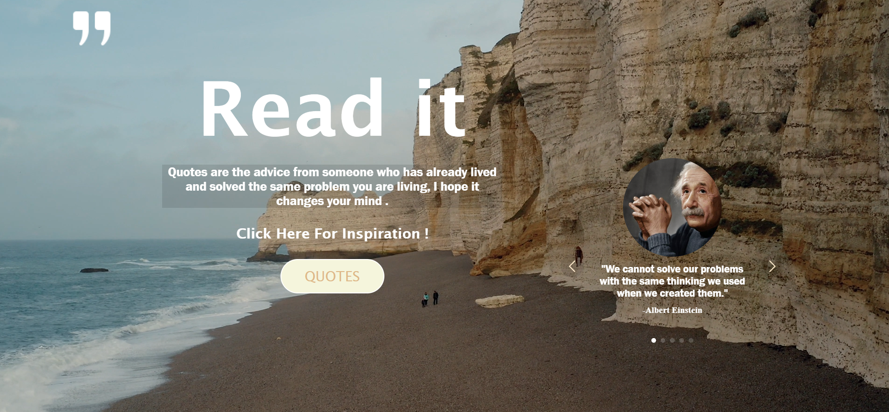
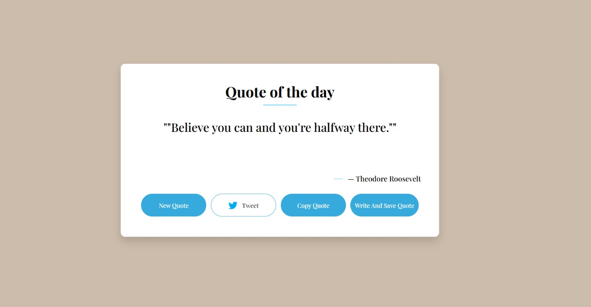

# Read it

**Read it** is a simple web project designed to offer a daily dose of inspiration and wisdom by showcasing carefully selected quotes. Whether you're seeking motivation to start your day, a thought to ponder, or simply impactful words to calm your mind, **Read it** provides an easy and enjoyable experience for discovering inspiring quotes.

## Overview of the Main User Interface

[](https://github.com/hanagamal7/Quotes_Project)

This snapshot showcases the main screen of the project. You can observe the serene natural background that sets a calm and reflective mood. Prominently displayed in the center is a welcoming title inviting the user to read ("Read it"), along with an introductory quote encouraging a shift in perspective. A clear call-to-action button prompts users to explore more inspiring quotes.

## Exploring the "Quote of the Day" Feature

[](https://github.com/hanagamal7/Quotes_Project)

This image highlights the "Quote of the Day" feature. In a clean and elegant design, an inspiring and impactful quote is presented, accompanied by the name of its author (in this case, Theodore Roosevelt). The interface also provides several interactive options:

* **New Quote:** To refresh and display a new quote.
* **Tweet:** To easily share the current quote on Twitter.
* **Copy Quote:** To copy the quote to the clipboard for use elsewhere.
* **Write And Save Quote:** (Functionality may vary) Potentially to write and save favorite quotes.

## How to Use

1.  **Open the application in your browser.**
2.  **Read the daily featured quote.**
3.  **Use the buttons to:**
    * **Get a new random quote.**
    * **Tweet the current quote.**
    * **Copy the quote to the clipboard.**
    * **Save the quote to your favorites** (if this functionality is implemented).

## Project Philosophy

As Albert Einstein's quote in the app states: *"We cannot solve our problems with the same thinking we used when we created them."* This project was built with the intention of providing alternative perspectives that might help users approach their challenges differently.

## Project Goal

This project aims to:

* Provide an easily accessible source of inspiring and helpful quotes.
* Create a simple and appealing user interface that focuses on presenting quotes clearly.
* Offer interactive features to enhance the user experience, such as sharing and copying.
* Allow for the addition of more features and functionalities in the future to expand the user experience.

## Current Features

* Displays a single random quote each time the page is loaded or refreshed.
* Clean and minimalist design that emphasizes the text and the inspiring background image.
* Utilizes an attractive background image that enhances the feeling of positivity and reflection.
* **Quote of the Day Feature:** Presents a specific quote from a notable figure with interactive options.
* **Interactive Buttons:** To generate a new quote, share the quote on Twitter, copy it, and potentially save it.

## Technologies Used

* **HTML:** To build the basic structure of the page.
* **CSS:** To style and format the elements, making the interface attractive and responsive.
* **JavaScript (Likely):** To add dynamic functionality such as changing quotes or other interactions.

## How to Run (If there's a code component)

If there's a local development setup involved:

1.  **Clone the repository:**
    ```bash
    git clone [https://github.com/hanagamal7/Quotes_Project.git](https://github.com/hanagamal7/Quotes_Project.git)
    cd Quotes_Project
    ```
2.  **Open the HTML file in your browser:**
    Open the `index.html` file in your preferred web browser.

## Contributions

Contributions to this project are welcome. If you have suggestions for improvements, have discovered bugs, or wish to add new features, please feel free to open an issue or submit a pull request.

